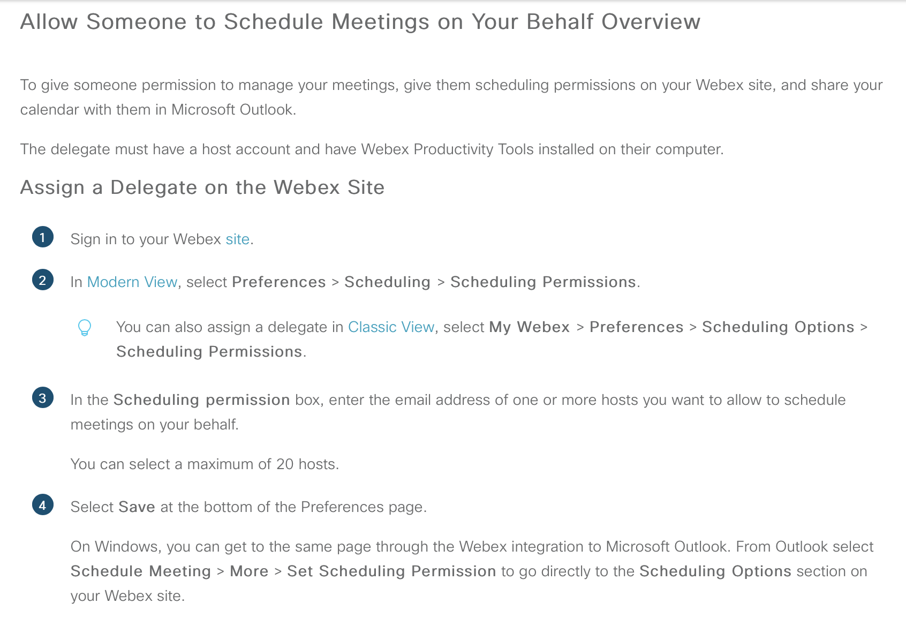
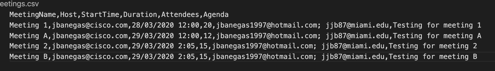
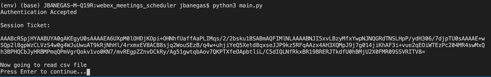
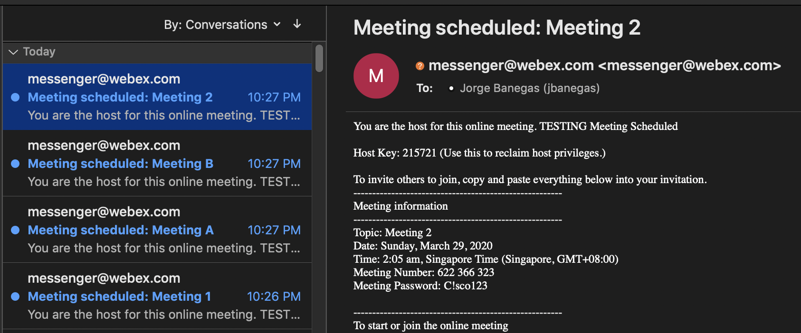
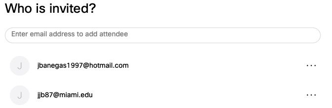
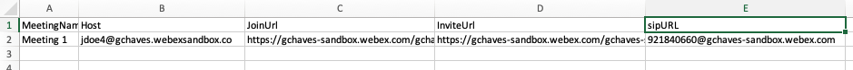

# Webex_meetings_trainings_scheduler
Script that schedules Webex Meetings/Trainings using information provided from a csv file

### Author:

* Jorge Banegas (jbanegas@cisco.com)
*  March 2020
***

### Prerequisites
* Python 3
* Webex account that has Meetings
* Webex ID and Password

### Important Notes
* In order to have someone else as a host, you must assign a delegate to the user who will be running the script and the host must be within the same webex organization.
* Script will generate error due to not having delegate permissions
* functions.py file will containing all the XML API calls if interested in tweaking the meeting/training details

# Setup instructions 
1. install and clone this repo onto a machine that has python3 installed 
2. install and create a virtual environment for your project (https://packaging.python.org/guides/installing-using-pip-and-virtual-environments/)
3. enter the virtual environment by running source (venv name)/bin/activate 
4. install dependencies by running pip3 install -r requirements.txt file
6. edit credentials.py to include webex ID and password (sitename, webexid, and password/token are required) or if you have oauth, follow the instructions in the ouath2.py file to generate an access token.
7. Insert csv file onto project folder and name it meetings.csv
8. Follow the format of the given csv
9. Run python script with python3 main.py

### Demo

Let us this example csv from the folder 

After running main.py, the script will first generate a session ticket from the credentials file in order to make APi calls

The script will now start to read the data from the csv file

The script will schedule the meeting and invite the host and antendees.

The script will generate a csv file contatining each meeting name,host, invitation url, and join url (url to the actual meetig)

### API Reference/Documentation:
* [Webex Meetings Python Functions] ] 
(https://github.com/CiscoDevNet/webex-meetings-python-samples)

* [Webex Meetings XML API Reference Guide] ] 
(https://developer.cisco.com/docs/webex-xml-api-reference-guide/#!meetings-xml-api-reference-guide)

## License
Provided under Cisco Sample Code License, for details see [LICENSE](LICENSE)

## Code of Conduct 
Our code of conduct is available [here](CODE_OF_CONDUCT.md)

## Contributing 
See our contributing guidelines [here](CONTRIBUTING.md)

### DISCLAIMER:
<b>Please note:</b> This script is meant for demo purposes only. All tools/ scripts in this repo are released for use "AS IS" without any warranties of any kind, including, but not limited to their installation, use, or performance. Any use of these scripts and tools is at your own risk. There is no guarantee that they have been through thorough testing in a comparable environment and we are not responsible for any damage or data loss incurred with their use.
You are responsible for reviewing and testing any scripts you run thoroughly before use in any non-testing environment.
