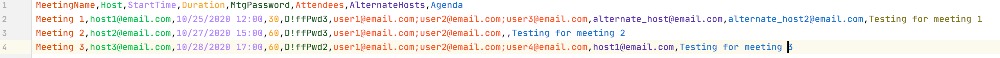
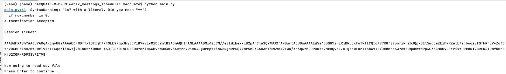
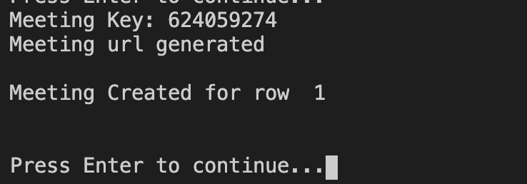
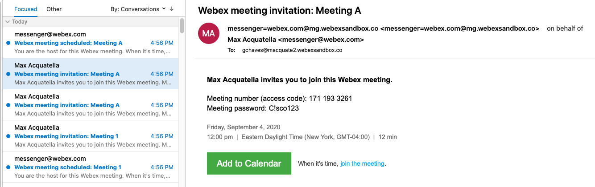
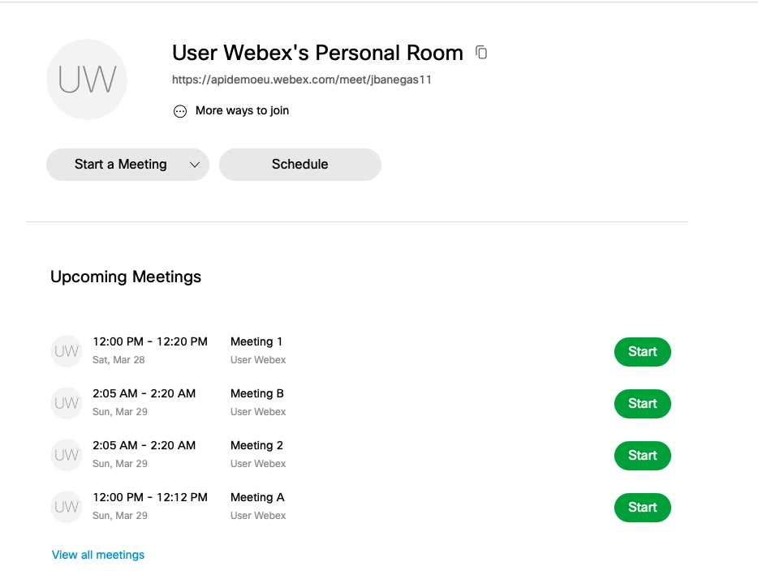
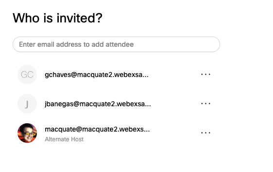
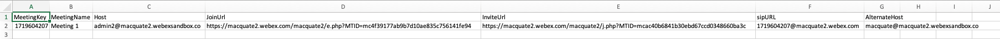

 # Webex Meetings Scheduler

This Python 3 sample code shows how to schedule multiple Webex Meetings sessions as specified in a comma separated values (.csv) source file using the Webex Meetings XML API.  
It uses the credentials of a site admin to be able to 
schedule meetings on behalf of multiple hosts on the same Webex Site and generates an separate .csv output file 
containing all the information needed (join URLs and dial URIs) to send to the hosts and participants of the meetings.
If properly configured with default settings, email invites will be sent automatically to hosts and attendees 
directly from the Webex Cloud. 

### What's new 11/18/20?
- The sample now automatically sets delegate permissions for all hosts in the input file to allow the username used in the credentials for this sample
 to schedule meetings on it's behalf. No need now to ask individual hosts to go and add the 'admin' account into their scheduling permissions list in Preferences  
- The meeting password is now a field in the input CSV file (`meetings.csv`) so it is no longer hard coded. You can set a different password for each meeting that the 
sample schedules
- The sample now handles multiple alternate hosts instead of just one. 
 
### Authors:

* Jorge Banegas (jbanegas@cisco.com)
* Gerardo Chaves (gchaves@cisco.com)
* Maxime Acquatella (macquate@cisco.com)

***

### Prerequisites
* Python 3
* Webex host accounts properly licensed for Meetings
* Webex site admin ID, email address and Password. If the site has Single Sign-On (SSO) enabled, 
and integration will have to be created on the Webex Developer site: https://developer.webex.com/docs/integrations to be used
 with this sample code. More details in the [oauth2.py](oauth2.py) file in this repository

### Important Notes
* In order to have someone else schedule meetings for hosts, you must assign a delegate to the user who will be running the script and the host 
must be within the same Webex organization. The SetDelegatePermissions() function of this sample takes care of setting that, but if you wish to disable 
that function and have hosts set it manually here are some instructions with screenshots to send to all hosts who's meetings this
sample code will be scheduling: [Allow Another Host to Schedule Meetings on Your Behalf](https://help.webex.com/en-us/nub7z8c/Allow-Another-Host-to-Schedule-Meetings-or-Training-Sessions-on-Your-Behalf) 
Be sure to instruct all other hosts to use the email address of the admin for the site that matches 
 the credentials you will use in the [credentials.py](credentials.py) file for the portion of the instructions that state: 
 _"type the email addresses of the users to whom you want to grant scheduling permission"_
* The .csv input file also provides an optional column to assign multiple Alternate Hosts if needed. The alternate hosts also need to be users in the same organization with a Webex Meetings licenses assign to them. 
* The Script will generate errors if you attempt to schedule meetings on behalf of other hosts besides the admin account
 if the delegate permissions are not properly set for those other hosts.
* The [functions.py](functions.py) file contains all the XML API calls if interested in adding functionality such as adding more meeting details.
* Included in the repository you can also find a [Postman collection](Postman%20collection%20-%20Webex%20Meetings%20XML%20API.json) that you 
can use to test out various Webex Meetings XML API call (not exhaustive) in case you want to test 
API functionality before adding it to your code.

# Setup instructions 
1. Install and clone this repo onto a machine that has python3 installed 
2. Install and create a virtual environment for your project (https://packaging.python.org/guides/installing-using-pip-and-virtual-environments/)
3. Enter the virtual environment by running source (venv name)/bin/activate 
4. Install dependencies by running:  
```pip3 install -r requirements.txt```  
6. Edit [credentials.py](credentials.py) to include webex ID and password (sitename, webexid, and password/token are required) or, 
if your Webex site has **Single Sign-on (SSO)** enabled (https://help.webex.com/en-us/lfu88u/Single-Sign-On-Integration-in-Cisco-Webex-Control-Hub#CMGT_RF_S9BDF982_00) , 
follow the instructions in the [oauth2.py](oauth2.py) file to generate an access token to use instead of username/password with this sample code.
7. Create or edit the [meetings.csv](meetings.csv) input file in the local directory
8. Follow the format in that .csv file to specify the meeting Host, time, date (MM/DD/YYYY), Alternate Hosts and attendees to be invited. You can specify multiple 
attendees and alternate hosts by separating each user id (email address) by a semi-colon

This is what the sample [meetings.csv](meetings.csv) file provided in the repository looks like: 




### Running the sample

Once everything is set up, you can run python script with this command:  
```python3 main.py```

The first thing that the [main.py](main.py) script does is generate a session ticket from the credentials file in order to make API calls



After you press enter, the script will start to read the data from the [meetings.csv](meetings.csv) file



The script will use the Webex Meetings XML API to schedule the meetings and invite the hosts, alternate host and attendees.









### Output

The last portion of the script will generate a csv file (**data.csv**) in the local directory containing, 
for each successfully scheduled meeting, the following fields:
 meeting key, meeting name, host, join url (url to the actual meeting), invitation url, SIP URL (to join via a SIP device or custom app using Webex Browser SDK directly) and alternate host:  



Also, if properly configured with default settings on the Webex Site, email invites will be sent automatically to hosts and attendees 
directly from the Webex Cloud. 

#### NOTE   
If you want to list the meetings scheduled using the Webex Teams REST API, be sure to specify "scheduledMeeting" as the meeting type:
``` https://webexapis.com/v1/meetings?meetingType=scheduledMeeting ```
The default meetingType when you use that endpoint is "meetingSeries" which only lists those meetings you scheduled manually or using the REST API, not those that where created using the XML API as shown in this sample code. 

### API Reference/Documentation:
* [Webex Meetings Python Functions](https://github.com/CiscoDevNet/webex-meetings-python-samples)

* [Webex Meetings XML API Reference Guide](https://developer.cisco.com/docs/webex-xml-api-reference-guide/#!meetings-xml-api-reference-guide)

## License
Provided under Cisco Sample Code License, for details see [LICENSE](LICENSE)

## Code of Conduct 
Our code of conduct is available [here](CODE_OF_CONDUCT.md)

## Contributing 
See our contributing guidelines [here](CONTRIBUTING.md)

### DISCLAIMER:
<b>Please note:</b> This script is meant for demo purposes only. All tools/ scripts in this repo are released for use "AS IS" without any warranties of any kind, including, but not limited to their installation, use, or performance. Any use of these scripts and tools is at your own risk. There is no guarantee that they have been through thorough testing in a comparable environment and we are not responsible for any damage or data loss incurred with their use.
You are responsible for reviewing and testing any scripts you run thoroughly before use in any non-testing environment.
